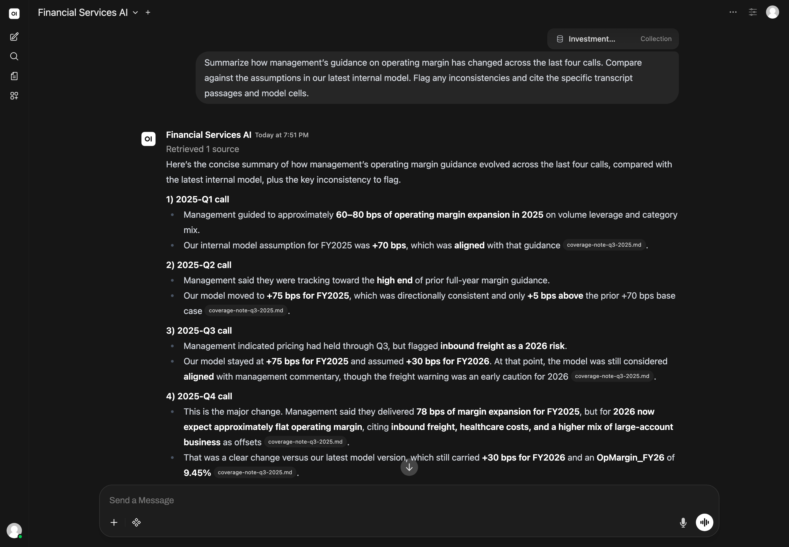
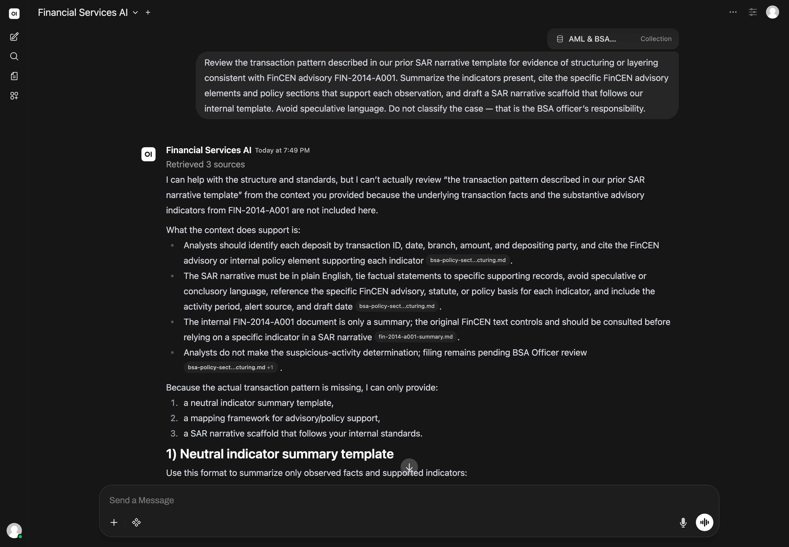
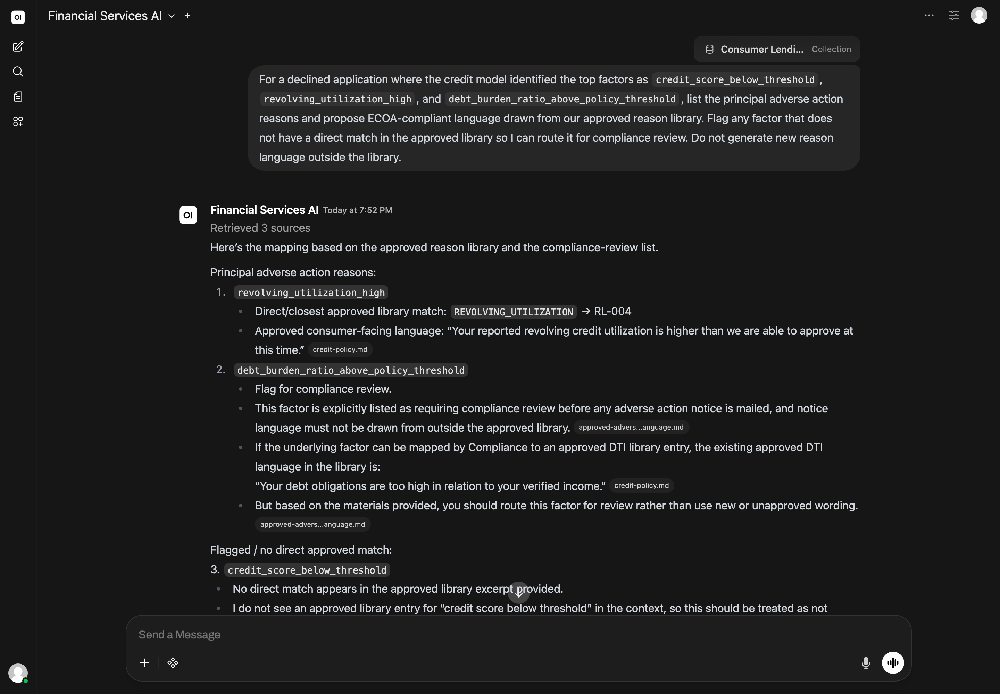
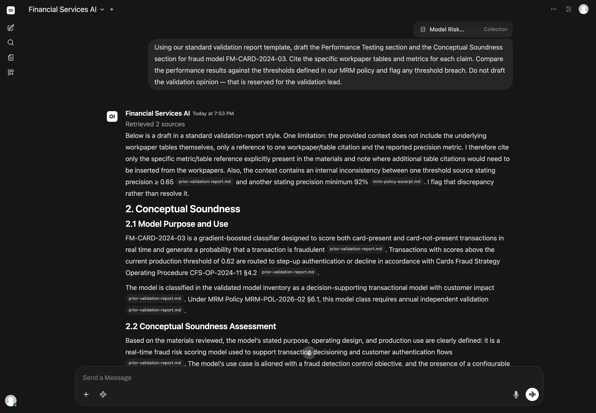
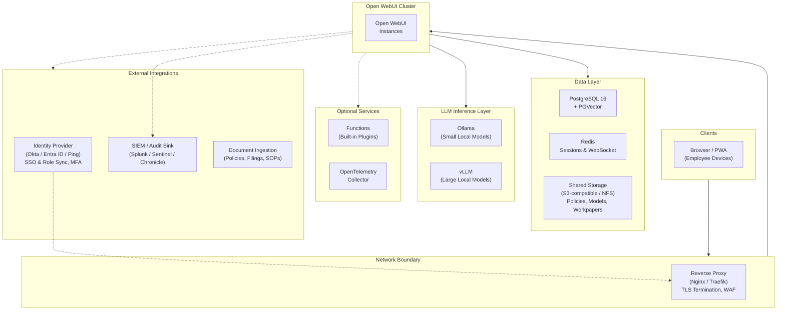

# What Would It Take for a Financial Services Firm to Run AI In-House?

*For CIOs, chief risk officers, heads of compliance, and innovation leaders at banks, broker-dealers, asset managers, and insurers evaluating AI solutions for their firm.*

*This article is for informational purposes only and does not constitute legal, regulatory, compliance, financial, tax, or investment advice. Firms should evaluate AI deployments with qualified counsel and risk professionals based on their charter, regulatory regime, jurisdiction, and customer obligations.*

**Key Takeaways**
- 67% of banks report using AI in 2025, and 77% have launched or soft-launched GenAI applications — yet roughly 30% of banks restrict or fully ban employee use of generative AI tools, leaving a wide gap between sanctioned capability and day-to-day reality
- "Shadow AI" — employees pasting customer data, code, or internal memos into consumer AI tools — has become a leading channel for unauthorized data movement and is increasingly visible to regulators like FINRA and NYDFS
- Self-hosted AI platforms can support data locality, role-based access control, conversation logging, and source-grounded responses on firm-controlled infrastructure, which firms can evaluate against obligations under GLBA, NYDFS 23 NYCRR Part 500, FINRA supervisory expectations, and (for EU exposure) the EU AI Act
- A production deployment requires dedicated compute, identity integration, and ongoing model risk governance — most of the work is policy, not software
- Operational responsibilities shift from a vendor to the firm: model inventory, validation, change management, vendor due diligence, and audit trail retention

---

## Why This Question Matters Now

The 2025 numbers for AI in financial services tell two parallel stories.

In the first, generative AI has moved from experiment to operating system. EY-Parthenon's banking survey found that [**77% of banks have launched or soft-launched generative AI applications**](https://www.ey.com/en_us/insights/banking-capital-markets/ai-in-banking-ey-parthenon-genai-survey-insights), compared with 61% in 2023, and 47% report fully implementing at least one application in production. FINRA's [2026 Annual Regulatory Oversight Report](https://www.finra.org/rules-guidance/guidance/reports/2026-finra-annual-regulatory-oversight-report/gen-ai), released in December 2025, lists "summarization and information extraction" as the top GenAI use case among member firms, followed by conversational question-answering and sentiment analysis.

In the second story, firms are pulling back. [American Banker reported in 2025](https://www.americanbanker.com/news/a-third-of-banks-ban-employees-from-using-gen-ai-heres-why) that roughly 30% of financial services leaders restrict generative AI inside their firms — about 15% have banned it for all employees, another 20% allow it only for specific functions, and 26% are actively considering new restrictions. Bank of America, Citigroup, Deutsche Bank, Goldman Sachs, JPMorgan, and Wells Fargo have all curtailed access to public chatbots at various points, citing data leakage and confidentiality concerns.

Between those two stories sits a third one that compliance and risk teams are watching closely. It is the story of **shadow AI**: employees who keep using consumer tools after the formal ban, often because the sanctioned alternatives do not yet exist. Security telemetry across multiple industries shows the pattern accelerating, with [one analysis attributing roughly 32% of all unauthorized corporate-to-personal data movement to generative AI tools](https://blog.intelligencex.org/shadow-ai-enterprise-risk-governance-2025). For a regulated financial institution, that movement may carry nonpublic customer information, trading positions, internal model parameters, or material non-public information out of the perimeter that examiners assume the firm is defending.

Four challenges are pushing firms to ask a more fundamental question about how AI is delivered:

**Customer data governance is non-negotiable, and AI vendors complicate it.** The [GLBA Safeguards Rule](https://www.ftc.gov/business-guidance/privacy-security/gramm-leach-bliley-act) requires covered financial institutions to maintain an information security program that protects customer information, including from third-party service providers. Many AI vendors operate as black boxes, which can make it difficult for firms to satisfy the due diligence, contractual safeguards, and audit-rights expectations that programs like the GLBA Safeguards Rule and NYDFS 23 NYCRR Part 500 are built around. [NYDFS issued updated guidance on third-party service providers in October 2025](https://www.dfs.ny.gov/industry-guidance/industry-letters/il20251021-guidance-managing-risks-third-party) emphasizing lifecycle oversight of vendor relationships, from initial due diligence through secure termination — a standard that is harder to evidence when prompts and completions flow through external APIs.

**Model risk management never went away — and the rules are tightening around AI.** The [revised interagency guidance on model risk management](https://www.federalreserve.gov/supervisionreg/srletters/SR2602.pdf), which the Federal Reserve, FDIC, and OCC issued in April 2026 to replace SR 11-7, takes a more principles-based approach but explicitly notes that **"generative AI and agentic AI models are novel and rapidly evolving"** and are not within its scope, while stressing that banking organizations must still apply their risk management and governance practices to those tools. The agencies have signaled that further guidance on AI is coming. For consumer credit decisions, the [CFPB has reiterated that creditors using complex algorithms or AI must still provide specific and accurate reasons for adverse actions](https://www.consumerfinance.gov/about-us/newsroom/cfpb-acts-to-protect-the-public-from-black-box-credit-models-using-complex-algorithms/) under ECOA and Regulation B — there is no carve-out for opacity.

**Audit, supervision, and disclosure obligations now apply to AI explicitly.** [FINRA's 2026 report](https://www.finra.org/rules-guidance/guidance/reports/2026-finra-annual-regulatory-oversight-report/gen-ai) makes clear that member firms are expected to modify written supervisory procedures for GenAI, with attention to governance, testing, monitoring, third-party risk, and — for agentic systems — explicit human checkpoints before any action that affects a customer or order. The [SEC's two 2024 enforcement actions for "AI washing"](https://www.sec.gov/newsroom/press-releases/2024-36) against Delphia and Global Predictions established that misleading statements about AI capabilities can trigger Marketing Rule liability, and the [SEC's 2025 examination priorities](https://www.sec.gov/files/2025-exam-priorities.pdf) include reviewing registrant AI representations for accuracy and assessing whether firms have policies and procedures to supervise AI use. For firms with European customers or operations, the [EU AI Act](https://artificialintelligenceact.eu/annex/3/) classifies AI used to evaluate creditworthiness or set credit scores as high-risk, with documented risk management, data governance, transparency, and human oversight requirements coming into force in August 2026, supervised in part by EBA, ESMA, and EIOPA.

**AI-enabled fraud has crossed from theoretical to operational.** In 2024, [a finance worker at engineering firm Arup transferred $25.6 million to fraudsters after attending a video call where the CFO and other "participants" were deepfake recreations](https://www.cnn.com/2024/05/16/tech/arup-deepfake-scam-loss-hong-kong-intl-hnk) generated from publicly available footage. [NYDFS's October 2024 AI cybersecurity guidance](https://www.dfs.ny.gov/industry-guidance/industry-letters/il20241016-cyber-risks-ai-and-strategies-combat-related-risks) called out exactly this scenario — social engineering enhanced by AI-generated audio, video, and text — and reminded covered entities that their risk assessments and authentication controls under 23 NYCRR Part 500 should reflect it. Multifactor authentication for all authorized users became a baseline expectation under that regulation in November 2025.

These challenges are leading some firms to ask whether AI they can *control*, *observe*, *validate*, and *govern centrally* might be worth exploring — rather than relying solely on consumer products or single-vendor SaaS for workloads that touch customer data, model outputs, or supervised activity.

---

## What Self-Hosted AI Would Actually Require

There is no shortage of AI products marketed to financial services. Many are well-engineered and easy to adopt. The strategic question is control: where customer data is processed, who can access it, how the firm can evidence that to a regulator, an internal audit team, or a customer who asks. For routine tasks with low sensitivity — drafting an internal training summary, generating variant copy for a marketing review — shared infrastructure may be a reasonable tradeoff. For workloads that touch nonpublic customer information, model parameters, supervisory records, suitability analyses, or trade ideas, tighter control is increasingly worth evaluating.

The question shifts from *"can our people use AI?"* to *"can we demonstrate to an examiner, an auditor, or a customer where that AI-generated output came from, what data was used, who reviewed it, and that it remained on infrastructure the firm controls?"*

When firms begin thinking about this seriously, the requirements tend to cluster around five areas:

- **Data locality.** The ability to run AI entirely on firm-controlled infrastructure, whether on-premise, in a private cloud, or in a managed virtual machine that meets the firm's data residency requirements. With the right configuration, this can reduce third-party data exposure, support obligations to keep nonpublic customer information within agreed boundaries, and reduce external API calls for inference. For firms operating under GLBA, NYDFS Part 500, EU GDPR, or jurisdictional bank secrecy regimes, the ability to keep data on-network is increasingly material.

- **Source-grounded responses with citations.** The ability for staff to query the firm's internal materials — policies, model documentation, prior regulatory correspondence, transaction systems, suitability files, research libraries — and receive responses with inline citations and relevance scores. This does not eliminate hallucination, but it can improve traceability for verification workflows. **All AI-generated content must be reviewed and verified by qualified personnel before reliance or use in any decision that affects a customer, an order, a filing, or a regulatory record.**

- **Group-based access control.** The ability to map role-based permissions to functional areas — investment research, AML/BSA, consumer lending, model risk, treasury operations, customer service, information security, and so on — and restrict which knowledge bases, models, and features each group can access. This matters both for least-privilege data governance and for ensuring that staff are working with appropriate information for their role and licensing.

- **Configurable audit, retention, and supervision controls.** Conversation logging tied to authenticated user identities, configurable retention, SSO integration, restrictions on chat deletion, and the ability to export records for supervisory review. Records of what AI-assisted queries produced what outputs, attributable to a named user, are directly relevant to the supervisory expectations FINRA has articulated and to the audit trail expectations embedded in SR 11-7's successor framework, GLBA Safeguards, and 23 NYCRR Part 500.

- **Scheduled and repeatable workflows.** The ability to define recurring AI tasks — a weekly summary of regulator letters for the compliance team, a daily anomaly review for the AML group, a monthly model performance check against benchmark data — that run automatically against the firm's tools and knowledge bases, post output back to a supervised channel, and surface on a shared timeline. This shifts AI from an ad-hoc helper into observable infrastructure with a documented cadence.

These criteria are not unique to any one product. They are the requirements that financial services technology leaders evaluating self-hosted AI tend to assess against.

---

## One Approach: Self-Hosting

[Open WebUI](https://docs.openwebui.com/) is a general-purpose, self-hostable AI platform with a publicly available codebase. It is one example of a platform that can be configured to address the requirements above. Firms should evaluate whether and how its capabilities fit their own regulatory, supervisory, and operational requirements.

### Illustrative Examples

> **Note:** The following scenarios are illustrative and do not represent validated or endorsed workflows. All client names, account numbers, transaction amounts, security identifiers, model names, and dollar figures in these scenarios are entirely fictional and created solely for illustration. Firms must design, test, and validate their own AI workflows according to their regulatory, supervisory, and governance requirements. All AI-generated content must be reviewed and verified by qualified personnel before reliance or use in any decision-making, customer-facing, or regulatory context.

#### Investment Research Synthesis from Internal Materials

A sell-side analyst is preparing a coverage update on a mid-cap industrials issuer. She has the company's last four quarterly call transcripts in her own files, the firm's internal earnings model, three previous notes published by her team, and a recent management meeting memo. Stitching the threads together by hand would mean re-reading every document, building a working timeline of guidance changes, and reconciling the model assumptions against what management has said in public.

She opens Open WebUI, configured with her team's research knowledge base: prior published notes, internal models, management meeting memos, and earnings call transcripts. She types: *"Summarize how management's guidance on operating margin has changed across the last four calls. Compare against the assumptions in our latest internal model. Flag any inconsistencies and cite the specific transcript passages and model cells."*

The response can draw from her team's research library, can cite each transcript by call date and timestamp range, can reference the specific cells in the internal model, and can flag where the model assumption is more or less aggressive than the most recent guidance. She clicks each citation to verify it against the source document before relying on any item in her note.

Because the knowledge base contains research that is firm-internal, she works with material that does not need to leave the supervised network. The conversation is logged under her SSO identity, attributable to her, and retained by the firm's research supervisory framework alongside the published note when it goes to clients — a record that can be reviewed if a question ever arises about how a recommendation was developed. The published note itself goes through her firm's normal research supervision and pre-publication review process; the platform is one input to that process, not a substitute for it.

#### AML Transaction Review and Draft SAR Narrative

A BSA analyst at a community bank is reviewing an alert generated by the transaction monitoring system. The alert flagged a small-business customer for a pattern of structured cash deposits across multiple branches over a 30-day window. The analyst needs to pull the relevant transaction history, characterize the pattern in plain English, and prepare a draft narrative for the BSA officer's review.

She opens Open WebUI, configured with the bank's AML knowledge base: the bank's BSA policy, an internal library of prior SAR narratives, FinCEN advisories on structuring and trade-based money laundering, and a redacted internal training corpus of past closed alerts. She uploads the customer's transaction export and types: *"Review these transactions for evidence of structuring or layering consistent with FinCEN advisory FIN-2014-A001. If a pattern is present, draft a SAR narrative that follows our internal template, cites the specific transaction IDs that support each statement, and avoids speculative language. Do not classify the case — that is the BSA officer's responsibility."*

The model returns a structured analysis: a chronological summary of the deposit pattern, an explicit reference to each transaction ID by line, an alignment table mapping observations to the elements of structuring described in the cited FinCEN advisory, and a draft narrative scaffold for the BSA officer. The narrative is written in the bank's house style as captured in prior SAR examples.

The analyst reviews each citation against the source transactions, makes the edits she would make to any analyst's first draft, and forwards the package to the BSA officer for the suspicious-activity determination. The conversation log retains the queries, the cited transactions, and the AI-drafted scaffold under her authenticated identity, supporting the bank's BSA recordkeeping requirements. **The decision to file a SAR remains a human, role-qualified determination — the AI workflow drafts and organizes; it does not file, and it does not opine on whether activity is suspicious.**

#### Adverse Action Reason Drafting for Consumer Lending

A credit operations specialist at a consumer lender is reviewing the daily queue of declined loan applications. The lender uses a machine learning credit decisioning model, and each declined application requires an adverse action notice that lists the specific, principal reasons for the decision under ECOA and Regulation B. Generic language is not sufficient: [the CFPB has explicitly stated](https://www.consumerfinance.gov/compliance/circulars/circular-2022-03-adverse-action-notification-requirements-in-connection-with-credit-decisions-based-on-complex-algorithms/) that creditors cannot rely on the sample form checklist if the listed reasons do not specifically and accurately reflect the principal reasons for the decision.

The specialist opens Open WebUI, configured with the lender's credit policy, the model documentation produced by model risk management (including the validated factor library and the explainability output for each declined application), a reference library of approved adverse action language, and the relevant CFPB circulars. She queries: *"For application A-2026-04481, list the top adverse action reasons as identified by the model explainability output. For each reason, propose ECOA-compliant language drawn from our approved reason library. Flag any reason that does not have a direct match in the approved library so I can route it for compliance review. Do not generate new reason language outside the library."*

The response uses the model's recorded SHAP-style factor contributions for that specific application — pulled from the model documentation rather than inferred — to identify the three principal factors that drove the decision. It maps each factor to the closest match in the firm's approved reason library, returns the proposed notice text, and flags one factor (a debt-burden ratio threshold) that does not have an exact library match, recommending it be sent to compliance before the notice is mailed. The specialist routes the flagged item, accepts the matched language for the other reasons after her own review, and sends the notice to the customer.

The conversation is retained under her identity. The lender's compliance team can review at any time how a specific notice was drafted, which factors were cited, and how the model's recorded explanation translated into customer-facing language. The notice itself remains the lender's responsibility under ECOA; the platform's role is to make the underlying factor-to-language mapping traceable.

#### Model Validation Report Drafting

A model risk analyst is drafting the annual validation report for a fraud detection model the firm uses to score card transactions in real time. The validation has been performed: backtesting datasets are assembled, stability statistics are calculated, and the model owner's responses to the validation findings are documented. The analyst's job over the next two days is to assemble the report itself, in the format the firm's model risk committee expects, with consistent language across sections and citations to the underlying validation artifacts.

He opens Open WebUI, configured with the firm's model risk knowledge base: the validated model inventory, prior validation reports for similar models, the firm's MRM policy, the relevant interagency guidance, and the validation workpapers for the current engagement. He uploads the new backtesting output and types: *"Using our standard validation report template, draft the Performance Testing section and the Conceptual Soundness section for fraud model FM-CARD-2024-03. Cite the specific workpaper tables and metrics for each claim. Compare the performance results against the thresholds defined in our MRM policy and flag any threshold breach. Do not draft the validation opinion — that is reserved for the validation lead."*

The model retrieves the relevant template sections from prior validation reports, applies the workpaper data to the standard report structure, and produces a draft that cites each numerical claim back to a specific workpaper table. It identifies one performance metric (precision at the 0.5% false-positive operating point) that falls outside the firm's MRM policy threshold for fraud models and flags it inline, with a note recommending model-owner remediation.

The analyst reviews every claim against the workpaper before incorporating any of it into the final report. The validation opinion itself remains the validation lead's responsibility under the firm's MRM policy; the platform's role is to assemble the supporting documentation consistently and to surface threshold breaches early in the drafting process rather than in committee review. The conversation is retained for the validation work file alongside the workpapers, the draft, and the final report.

---

## What Access Control Could Look Like

Open WebUI includes a group-based access control system. The table below shows one example of how a financial services firm might map functional roles to AI capabilities. **This is an illustrative configuration. Firms should design their own role structure based on their charter, supervisory regime, lines of business, risk tolerance, and applicable regulations.**

| Group | AI Capabilities | Knowledge Bases | Special Permissions |
|---|---|---|---|
| **Investment Research** | Full | Internal models, published notes, call transcripts, management meeting memos | Web search enabled, document extraction *(extract structured data from filings)* |
| **Wealth and Advisory** | Advanced analysis only | Approved product literature, suitability templates, regulatory bulletins | RAG-only mode *(responses grounded in approved internal materials)* |
| **AML and BSA Compliance** | Full | Transaction monitoring exports, SAR libraries, FinCEN advisories, prior regulator correspondence | Document extraction *(extract entities and patterns from transaction history)* |
| **Consumer Lending and Credit** | Advanced analysis only | Credit policy, model factor libraries, approved adverse action language, CFPB circulars | RAG-only mode *(responses grounded in approved policy documents)* |
| **Model Risk Management** | Full | Model inventory, validation workpapers, MRM policy, interagency guidance | Code interpreter *(run analysis scripts on validation datasets)* |
| **Operations and Treasury** | Advanced analysis only | Operations SOPs, reconciliation procedures, payment scheme rulebooks | Document extraction *(extract dates and amounts from settlement records)* |
| **Customer Service** | Basic tasks only | Approved FAQs, complaint-handling procedures, regulatory disclosure templates | No file upload, no web search |
| **Information Security** | Full | Vendor SOC 2 reports, NYDFS guidance, internal incident playbooks, threat intelligence feeds | Automation management *(schedule recurring monitoring workflows)* |

Groups can synchronize with the firm's identity provider (such as Okta, Microsoft Entra ID, Ping Identity, or Google Workspace) via OAuth, so role membership can stay aligned with the firm's directory as staff join, leave, or change functions.

---

## What Infrastructure Is Involved

*This section is a reference for the IT or technology team. If evaluating at a strategic level, the key takeaway is: a self-hosted AI platform can run on existing infrastructure (cloud VMs, on-premise servers, or a managed private cloud) and be deployed with dependencies that can run on internal infrastructure.*

For a mid-size firm (500–10,000+ employees), a production deployment typically requires high availability and data isolation. Here's a reference architecture using Open WebUI. For full deployment instructions, see the **[Technical Setup Guide](setup.md)**.

**Key design decisions:**
- **Stateless application nodes.** Horizontal scaling allows capacity to flex with demand across the firm and across business cycles such as quarter-end research production or month-end transaction review.
- **Inference can run locally** via Ollama (lightweight models) and vLLM (large models with GPU optimization), so prompts containing nonpublic customer information, model parameters, or internal research can remain on-network when the deployment is configured for local-only inference.
- **Unified data layer.** PostgreSQL handles both application data and vector search, reducing operational complexity and keeping the firm's policy, model, and procedure index on-premises.
- **Redis session coordination** enables multi-node deployments without session affinity, supporting deployments across multiple sites or availability zones.
- **Identity and audit are first-class.** All access goes through the firm's IdP with MFA — a baseline expectation under 23 NYCRR Part 500 since November 2025 — and conversation logs can be exported to the firm's SIEM for supervisory review and incident response. SSO integration also supports role syncing against the firm's HR directory, so functional group membership stays current as staff move between desks.
- **External integrations are optional and firm-specific.** The IdP enables role sync; the SIEM sink supports supervisory and security workflows; document ingestion pipelines feed approved policies, model documentation, and procedural materials into the knowledge base. Each integration carries its own contractual review and data governance assessment.

---

## Considerations Before Getting Started

Self-hosting AI is not trivial. Before committing, firms should consider:

- **Model risk governance.** Any AI workflow that supports a decision affecting a customer, a credit, a market position, a supervisory record, or a financial control is a candidate for the firm's model risk management framework. The [April 2026 interagency guidance](https://www.federalreserve.gov/supervisionreg/srletters/SR2602.pdf) replaces SR 11-7 with a more risk-based, principles-driven framework, but it also explicitly leaves generative and agentic AI out of scope, meaning firms must design their own governance, inventory, validation, and change-management practices for those tools. This is an organizational responsibility; the platform is one input. Firms should expect to scope, document, and validate each AI use case with their MRM function before production use.

- **Vendor and third-party diligence.** Even when the AI runs on internal infrastructure, dependencies (base models, embedding models, inference engines, document parsers, observability tools) come from vendors. NYDFS's October 2025 guidance and GLBA Safeguards Rule expectations push firms to evidence lifecycle vendor oversight — due diligence, contractual safeguards, ongoing monitoring, and secure offboarding — including for AI dependencies. Self-hosting reduces the surface, but does not eliminate it.

- **Supervision and recordkeeping.** FINRA's 2026 report is explicit that written supervisory procedures should be modified to cover GenAI, including which use cases are permitted, how outputs are reviewed before customer or order impact, how records are retained, and how third-party risk is managed. SEC- and FINRA-regulated firms should expect AI activity to be reviewable under the same supervisory and books-and-records standards as any other communication, model, or system.

- **Disclosure discipline.** [The SEC's 2024 AI-washing actions](https://www.sec.gov/newsroom/press-releases/2024-36) and [2025 examination priorities](https://www.sec.gov/files/2025-exam-priorities.pdf) have established that representations about AI capability — to clients, to investors, in marketing materials, in fund disclosures — must be specific, accurate, and supportable. Internal AI use does not require external disclosure in most cases, but any external claim about that use does. Firms should align marketing, investor relations, and disclosure controls with what the technology actually does.

- **EU AI Act exposure.** Firms with European customers or operations should evaluate whether any internal use case touches the Annex III categories (notably creditworthiness evaluation and credit scoring, with a carve-out for fraud detection). [High-risk system obligations](https://artificialintelligenceact.eu/annex/3/) — documented risk management, data governance, transparency, human oversight, post-market monitoring, and fundamental rights impact assessment — come into force in August 2026, with enforcement supervised in part by the financial services authorities of member states alongside EBA, ESMA, and EIOPA.

- **Infrastructure costs.** Open WebUI itself is free to use (see license for terms), but the servers, storage, GPU compute, and networking required to run it are not. A single-team pilot may run on a single GPU-equipped VM; a firm-wide deployment involves dedicated compute, redundant storage, and ongoing network costs. The right configuration depends on how many concurrent users the firm expects and which model capabilities are required for each functional group.

- **Validation, testing, and ongoing maintenance.** Any AI deployment in a regulated financial services environment should go through security review, model risk review, supervisory controls design, and integration testing before production use. This is typically a multi-week to multi-month program, and shortcuts taken here tend to reappear as supervisory findings later. Operationally, model updates, security patches, knowledge base curation, user access reviews, and audit log retention are ongoing responsibilities that shift from a vendor to the firm's own team or a managed services partner.

For firms that want to explore technical implementation details, the complete Docker Compose stack, RBAC configuration guide, and security hardening checklist are in our companion guide:

**[Technical Setup Guide →](setup.md)**

For organizations that want deployment guidance, [Open WebUI Enterprise](https://docs.openwebui.com/enterprise/) offers hands-on support including security and compliance guidance *(compliance determination remains the firm's responsibility)*, white-label branding, and dedicated SLAs.

*Note: No software alone establishes legal, regulatory, or supervisory compliance. Firms should validate controls, policies, and use cases with qualified legal, compliance, risk, and information security counsel.*

**[Learn more about Enterprise → sales@openwebui.com](mailto:sales@openwebui.com)**

---

### Disclaimer

*Open WebUI is a general-purpose AI platform. It is not a validated financial services system and is not authorized, certified, or qualified for any specific regulatory regime. All compliance and supervisory determinations — including GLBA, NYDFS 23 NYCRR Part 500, FINRA supervisory expectations, SEC Marketing Rule and books-and-records obligations, ECOA and Regulation B adverse action requirements, BSA/AML recordkeeping, interagency model risk management guidance, EU AI Act and GDPR obligations, and any other applicable framework — are the sole responsibility of the deploying firm. AI-generated content is not a substitute for professional financial, legal, compliance, risk, or supervisory judgment and must be reviewed by qualified personnel before any decision, customer communication, filing, or regulatory record. Mention of third-party statistics, regulations, or platforms is for informational context only and does not represent an endorsement or a guarantee of outcomes.*

---

*Open WebUI is free to use and self-hostable. It powers AI deployments at organizations ranging from small teams to Fortune 500 companies. [See who's using Open WebUI →](https://docs.openwebui.com/enterprise/customers/)*

---

### References

1. *2026 FINRA Annual Regulatory Oversight Report — GenAI: Continuing and Emerging Trends.* FINRA, December 2025. [finra.org](https://www.finra.org/rules-guidance/guidance/reports/2026-finra-annual-regulatory-oversight-report/gen-ai)
2. *AI in Banking: EY-Parthenon GenAI Survey Insights.* EY-Parthenon, 2025. [ey.com](https://www.ey.com/en_us/insights/banking-capital-markets/ai-in-banking-ey-parthenon-genai-survey-insights)
3. *A Third of Banks Ban Employees from Using Gen AI.* American Banker, 2025. [americanbanker.com](https://www.americanbanker.com/news/a-third-of-banks-ban-employees-from-using-gen-ai-heres-why)
4. *Industry Letter: Cybersecurity Risks Arising from Artificial Intelligence and Strategies to Combat Related Risks.* New York Department of Financial Services, October 16, 2024. [dfs.ny.gov](https://www.dfs.ny.gov/industry-guidance/industry-letters/il20241016-cyber-risks-ai-and-strategies-combat-related-risks)
5. *Industry Letter: Guidance on Managing Risks Related to Third-Party Service Providers.* New York Department of Financial Services, October 21, 2025. [dfs.ny.gov](https://www.dfs.ny.gov/industry-guidance/industry-letters/il20251021-guidance-managing-risks-third-party)
6. *Revised Guidance on Model Risk Management (SR 26-02).* Board of Governors of the Federal Reserve System, FDIC, and OCC, April 2026. [federalreserve.gov](https://www.federalreserve.gov/supervisionreg/srletters/SR2602.pdf)
7. *Consumer Financial Protection Circular 2022-03: Adverse Action Notification Requirements in Connection with Credit Decisions Based on Complex Algorithms.* Consumer Financial Protection Bureau. [consumerfinance.gov](https://www.consumerfinance.gov/compliance/circulars/circular-2022-03-adverse-action-notification-requirements-in-connection-with-credit-decisions-based-on-complex-algorithms/)
8. *SEC Charges Two Investment Advisers with Making False and Misleading Statements About Their Use of Artificial Intelligence.* U.S. Securities and Exchange Commission, March 2024. [sec.gov](https://www.sec.gov/newsroom/press-releases/2024-36)
9. *Annex III: High-Risk AI Systems Referred to in Article 6(2).* EU Artificial Intelligence Act (Regulation EU 2024/1689). [artificialintelligenceact.eu](https://artificialintelligenceact.eu/annex/3/)
10. *Arup Revealed as Victim of $25 Million Deepfake Scam Involving Hong Kong Employee.* CNN Business, May 2024. [cnn.com](https://www.cnn.com/2024/05/16/tech/arup-deepfake-scam-loss-hong-kong-intl-hnk)
11. *Gramm-Leach-Bliley Act.* U.S. Federal Trade Commission. [ftc.gov](https://www.ftc.gov/business-guidance/privacy-security/gramm-leach-bliley-act)
12. *Shadow AI: The Growing Hidden Threat to Enterprise Security, Governance, and Compliance.* IntelligenceX, 2025. [blog.intelligencex.org](https://blog.intelligencex.org/shadow-ai-enterprise-risk-governance-2025)
